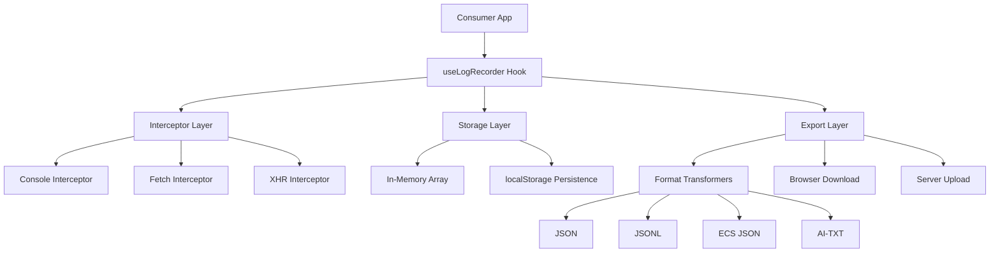

# Architecture Overview

This document describes the internal architecture and design principles of `@zaob/glean-debug-logger`.

## Core Philosophy

- **Zero Runtime Dependencies**: Keep the library lightweight and avoid version conflicts.
- **Production-Ready**: High performance, memory-safe, and secure by default.
- **AI-First**: Structured data formats (JSONL, ECS) designed for automated analysis.
- **Modular Design**: Interceptors, utilities, and UI are loosely coupled.

## System Architecture

The library follows a modular architecture centered around the `useLogRecorder` hook.

## 1. Interceptor Layer

Interceptors use "monkey-patching" (function wrapping) to capture global events without requiring code changes in the host application.

### Console Interceptor
- Replaces `window.console` methods (`log`, `error`, etc.).
- Safely stringifies objects using `safeStringify` to prevent circular reference errors.
- Truncates long strings (>5000 chars) to maintain performance.
- Restores original methods on unmount.

### Network Interceptors (Fetch & XHR)
- **Fetch**: Wraps the global `window.fetch` function.
- **XHR**: Wraps `XMLHttpRequest.prototype.open` and `send`.
- **Correlation**: Assigns unique IDs to request/response pairs.
- **Timing**: Measures duration between request start and response completion.
- **Sanitization**: Automatically redacts sensitive headers (Authorization, etc.) and body fields.

## 2. Storage Layer

Logs are stored primarily in a reactive memory array to ensure fast UI updates.

- **Maximum Capacity**: Configurable `maxLogs` (default 1000) prevents memory leaks. When the limit is reached, the oldest logs are removed (FIFO).
- **Persistence**: If `enablePersistence` is true, logs are synced to `localStorage`. This allows debugging across page refreshes or crashes.

## 3. Utility Layer

### Sanitization (`src/utils/sanitize.ts`)
- **Data Redaction**: Recursively traverses objects to find and mask sensitive keys.
- **Filename Cleaning**: Ensures generated filenames are safe for all operating systems.

### Filename Templating (`src/utils/filename.ts`)
Uses a placeholder system to generate descriptive filenames:
- `{env}`, `{userId}`, `{sessionId}`, `{timestamp}`, `{date}`, `{time}`, `{errorCount}`, `{logCount}`, `{browser}`, `{platform}`, `{url}`.

### Format Transformers
- **ECS**: Transforms logs into Elastic Common Schema (v1.12.0).
- **JSONL**: Generates line-delimited JSON for streaming and AI analysis.
- **AI-TXT**: Converts logs into a structured, key-value text format that is highly readable for LLMs.

## 4. UI Layer

### `DebugPanel`
- A complex React component that provides a dashboard for the collected logs.
- Handles keyboard shortcuts (`Ctrl+Shift+D`).
- Implements "Directory Picker" API support (for Chrome/Edge) to allow saving to a specific local folder.

### `DebugPanelMinimal`
- A lightweight alternative focused on zero-config usage.

## Lifecycle Management

1. **Mount**: `useLogRecorder` is called. It initializes state from `localStorage` if available and activates all interceptors.
2. **Runtime**: Interceptors capture events, sanitize data, and update the log state.
3. **Unmount**: The hook's cleanup function is called, which restores original global functions and detaches event listeners.
